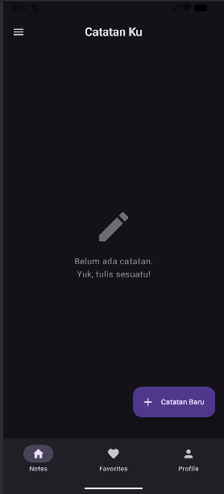
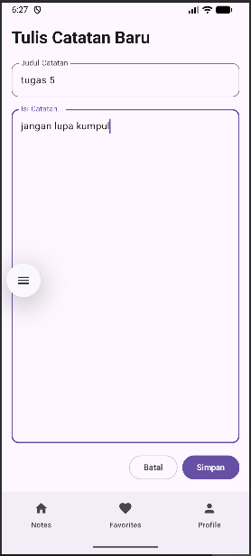
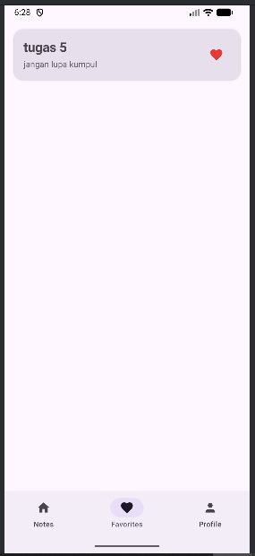
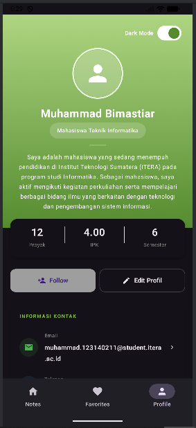

# Tugas Praktikum Minggu 5 - Navigasi Compose & State Lanjutan

* **Nama : Muhammad Bimastiar**
* **NIM : 123140211**

## Deskripsi Tugas
Mengembangkan proyek aplikasi dari minggu sebelumnya dengan mengimplementasikan Jetpack Navigation Compose untuk membuat perpindahan antar layar (*multi-screen*), sekaligus menambahkan fungsionalitas CRUD sederhana menggunakan State Management. Berikut adalah fitur dan ketentuan yang diimplementasikan pada praktikum ini:

1. **Bottom Navigation & Penggabungan Tugas 4:**
    - Menambahkan navigasi bawah dengan 3 tab: `Notes`, `Favorites`, dan `Profile`.
    - Mengintegrasikan `ProfileScreen` dan `ProfileViewModel` dari tugas minggu lalu secara sempurna ke dalam tab Profile.
2. **Sistem Navigasi yang Proper (Passing Arguments):**
    - Menerapkan navigasi dari layar List ke Detail dan Edit dengan mengirimkan argument `noteId`.
    - Mengimplementasikan fungsi `popBackStack()` agar pengguna dapat kembali ke layar sebelumnya dengan alur yang benar.
3. **State Management (NotesViewModel):**
    - *Extra:* Tidak hanya sekadar dummy UI, aplikasi ini menggunakan `NotesViewModel` dengan `StateFlow` agar pengguna bisa benar-benar **menambah**, **mengedit**, dan menyematkan catatan sebagai **Favorit**.
4. **Peningkatan UI/UX (Material Design 3):**
    - *Extra:* Tampilan dipercantik menggunakan komponen Material 3, seperti *Elevated Card*, *Extended Floating Action Button*, serta penanganan *Empty State* (layar kosong) yang interaktif jika tidak ada catatan.

## Struktur Folder
Proyek ini mengadopsi pemisahan *layer* yang terstruktur (UI, ViewModels, Navigation). Berikut adalah susunan *package* utamanya:

```text
composeApp/src/commonMain/kotlin/org/example/project/
├── App.kt                 # Entry point, inisialisasi NavHost & Scaffold (BottomBar)
├── components/
│   └── BottomNav.kt       # Komponen UI untuk Bottom Navigation
├── data/
│   └── ProfileUiState.kt  # (Dari Praktikum 4) Data class penampung state
├── navigation/
│   └── Routes.kt          # Definisi Sealed Class untuk rute layar dan argument
├── ui/
│   ├── NotesScreens.kt    # Kumpulan layar Notes (List, Detail, Add, Edit, Favorites)
│   └── ProfileScreen.kt   # (Dari Praktikum 4) Layar profil pengguna
└── viewmodel/
    ├── NotesViewModel.kt  # Mengelola logika state untuk daftar catatan
    └── ProfileViewModel.kt# (Dari Praktikum 4) State holder untuk profil
```

## Cara Menjalankan Aplikasi (Langkah-langkah)

Proyek ini menggunakan basis **Jetpack Compose Multiplatform**. Berikut panduannya:

1.  **Persiapan IDE:** Gunakan **Android Studio** versi terbaru.
2.  **Buka Proyek:** Buka folder proyek dan tunggu proses sinkronisasi Gradle (pastikan dependensi `navigation-compose` terunduh).
3.  **Jalankan Aplikasi:** - Untuk **Android**: Tekan `Shift + F10` atau klik tombol hijau **Run** ke emulator/perangkat fisik.
    - Untuk **Desktop**: Jalankan konfigurasi `jvmRun`.
4.  **Uji Coba Fitur:** - Klik **Tombol (+) Catatan Baru** untuk mencoba mengetik dan menyimpan catatan nyata.
    - Klik ikon **Hati (Love)** pada kartu catatan, lalu cek tab **Favorites** di navigasi bawah.
    - Klik area kartu catatan untuk masuk ke layar Detail, lalu coba fitur **Edit Catatan**.
    - Buka tab **Profile** untuk menguji perubahan Dark Mode (terintegrasi dengan tampilan catatan).

## Hasil

### 1. Tampilan Notes & Empty State
*(Tampilan saat aplikasi baru dibuka dan setelah catatan ditambahkan)*




### 2. Tampilan Tambah/Edit Catatan
*(Layar interaktif dengan form input untuk menyimpan data ke ViewModel)*



### 3. Tampilan Favorit & Detail Catatan
*(Navigasi detail argument dan list catatan favorit)*



### 4. Tampilan Profile & Dark Mode
*(Layar profil dari tugas sebelumnya yang warnanya menyesuaikan tema aplikasi)*

